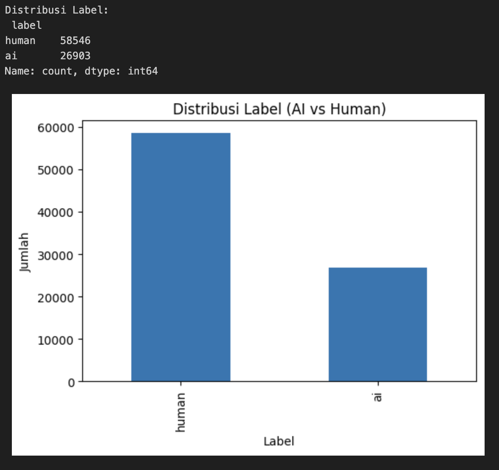
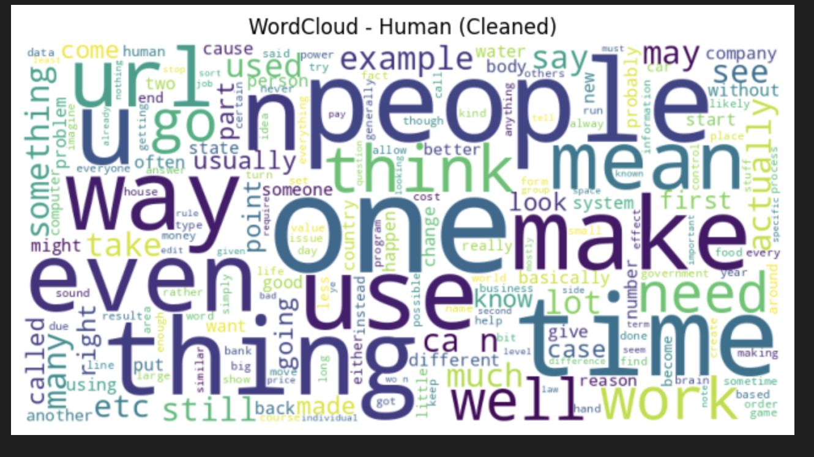
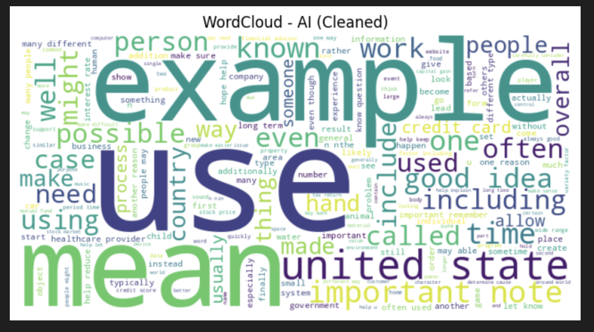
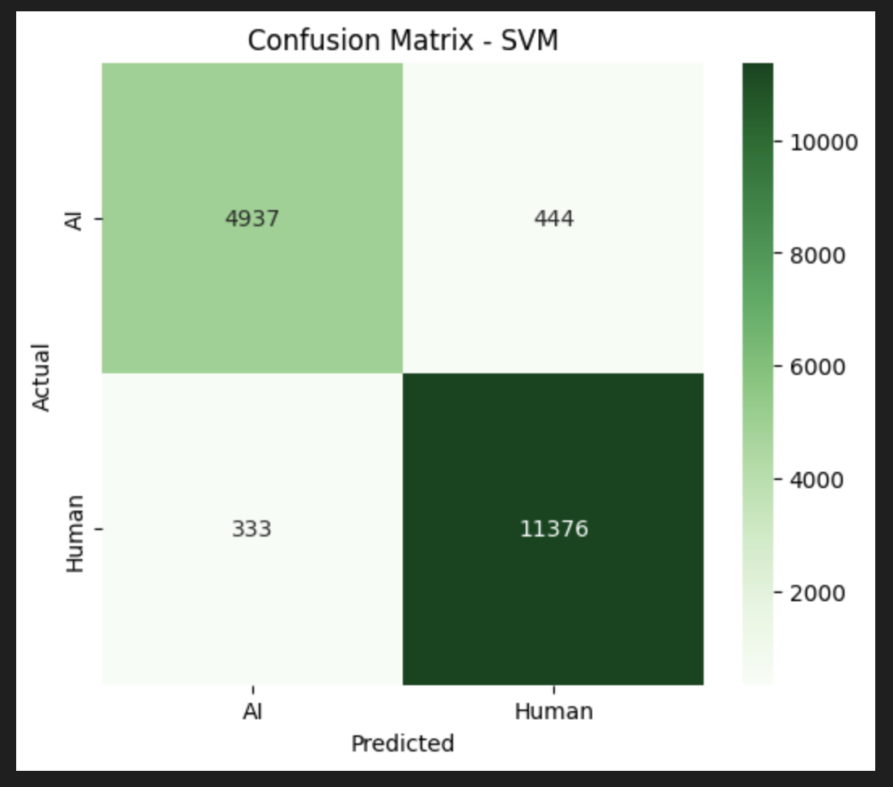
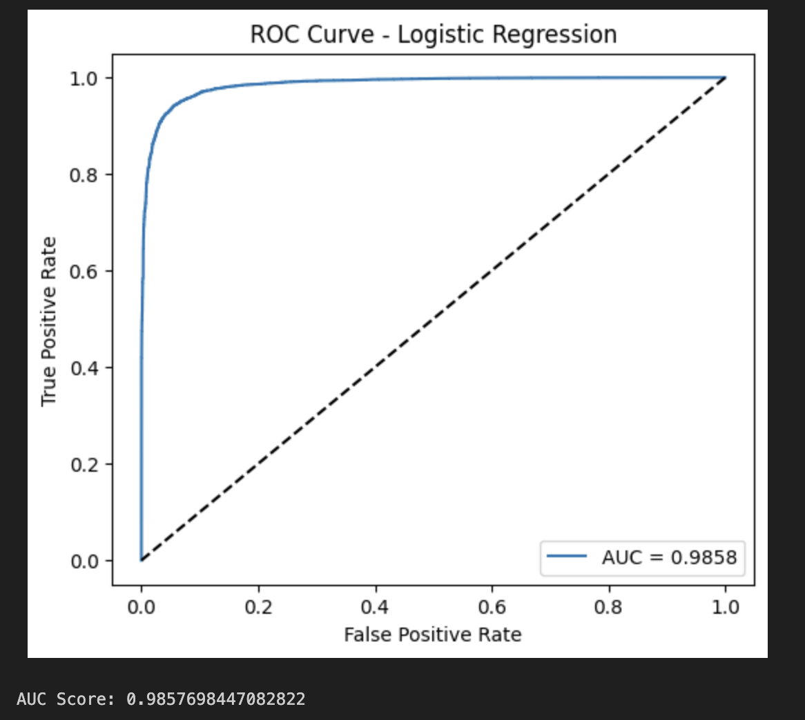

# Sistem Deteksi Teks Buatan AI Menggunakan NLP

## 📌 Overview

Proyek ini merupakan implementasi sistem untuk mendeteksi apakah suatu teks merupakan teks yang dibuat oleh manusia atau dihasilkan oleh Artificial Intelligence (AI) menggunakan pendekatan **Natural Language Processing (NLP)** dan **Machine Learning**.

Dataset yang digunakan berisi pasangan pertanyaan dan jawaban dengan label **Human** dan **AI**. Teks diproses melalui beberapa tahapan preprocessing, kemudian direpresentasikan menggunakan **TF-IDF** sebelum digunakan untuk proses klasifikasi.

Dua algoritma machine learning yang digunakan dalam eksperimen ini adalah **Logistic Regression** dan **Linear Support Vector Machine (SVM)**.

---

## 🎯 Objectives

Tujuan dari proyek ini adalah:

- Menganalisis karakteristik teks pada dataset.
- Melakukan preprocessing terhadap data teks.
- Mengubah teks menjadi representasi numerik menggunakan TF-IDF.
- Membangun model klasifikasi untuk membedakan teks buatan manusia dan teks buatan AI.
- Membandingkan performa Logistic Regression dan Linear SVM.
- Mengevaluasi hasil klasifikasi menggunakan beberapa metrik evaluasi.

---

## 📊 Dataset

Dataset utama yang digunakan dalam proyek ini adalah **HC3 (Human ChatGPT Comparison Corpus)** dalam format klasifikasi biner.

Dataset terdiri dari:

- **85.449 data**
- **3 kolom:** `question`, `answer`, dan `label`
- **58.546 teks Human**
- **26.903 teks AI**
- **18 missing value** pada kolom `answer`
- **3.019 duplicate data**

Label yang digunakan:

| Label | Jumlah |
|-------|-------:|
| Human | 58.546 |
| AI | 26.903 |
| **Total** | **85.449** |

Dataset utama tidak disertakan langsung dalam repository karena ukuran file dan pertimbangan pengelolaan data.

---

## 🔬 Methodology

### 1. Exploratory Data Analysis

Analisis awal dilakukan untuk memahami karakteristik dataset, distribusi label, missing value, duplicate data, panjang teks, serta karakteristik kata pada masing-masing kelas.

Beberapa analisis yang dilakukan meliputi:

- Pemeriksaan struktur dan ukuran dataset
- Pemeriksaan missing value
- Pemeriksaan duplicate data
- Analisis distribusi label
- Analisis panjang teks
- Analisis kata yang sering muncul
- Visualisasi WordCloud untuk kelas Human dan AI

### 2. Text Preprocessing

Tahapan preprocessing meliputi:

- Case folding
- Penghapusan tanda baca dan simbol
- Normalisasi teks
- Tokenization
- Stopword removal
- Lemmatization

### 3. Feature Extraction

Teks yang telah melalui preprocessing direpresentasikan menggunakan **TF-IDF (Term Frequency-Inverse Document Frequency)**.

Konfigurasi yang digunakan:

```python
TfidfVectorizer(
    max_features=5000,
    ngram_range=(1, 2),
    min_df=2
)
```

Parameter yang digunakan:

| Parameter | Nilai |
|-----------|-------|
| `max_features` | 5000 |
| `ngram_range` | (1, 2) |
| `min_df` | 2 |

Hasil ekstraksi menghasilkan matriks dengan ukuran:

```text
85.449 samples × 5.000 features
```

Sparsity matriks sekitar **99,14%**.

### 4. Machine Learning

Dua algoritma digunakan dalam eksperimen:

- Logistic Regression
- Linear Support Vector Machine (SVM)

### 5. Evaluation

Evaluasi dilakukan menggunakan:

- Accuracy
- Precision
- Recall
- F1-Score
- Confusion Matrix
- ROC Curve
- AUC

---

## 📈 Results

Hasil eksperimen menunjukkan performa sebagai berikut:

| Model | Accuracy | Macro F1-Score |
| ------------------- | -------- | -------------- |
| Logistic Regression | 94.59% | 0.94 |
| Linear SVM | 95.45% | 0.95 |

Pada eksperimen ini, **Linear SVM memperoleh accuracy sebesar 95.45% dan Macro F1-Score sebesar 0.95**.

Untuk evaluasi ROC, **Logistic Regression memperoleh nilai AUC sebesar 0.9858**.

> **Catatan:** hasil tersebut merupakan hasil eksperimen pada notebook proyek dan dapat dipengaruhi oleh dataset, preprocessing, konfigurasi TF-IDF, serta proses pembagian data yang digunakan.

---

## 🖼️ Project Results

Beberapa hasil analisis dan evaluasi model dapat dilihat pada folder [`screenshots/`](screenshots/).

### Distribusi Label



### WordCloud Teks Human



### WordCloud Teks AI



### Confusion Matrix Linear SVM



### ROC Curve



---

## 📁 Repository Structure

```text
sistem-deteksi-teks-ai-nlp/
│
├── README.md
│
├── notebooks/
│   └── KODE_PROYEK_PEMTEKS_KEL_10.ipynb
│
├── data/
│   └── README.md
│
├── results/
│   ├── README.md
│   ├── tfidf_features.csv
│   ├── tfidf_matrix_shape.txt
│   └── cleaned_preview.csv
│
└── screenshots/
    ├── confusion_matrix_svm.png
    ├── label_distribution.png
    ├── roc_curve.png
    ├── wordcloud_ai.png
    └── wordcloud_human.png
```

---

## 🛠️ Tools & Technologies

- **Python**
- **Jupyter Notebook**
- **Pandas**
- **NumPy**
- **Scikit-learn**
- **NLTK**
- **Matplotlib**
- **Seaborn**
- **WordCloud**
- **Natural Language Processing**
- **TF-IDF**
- **Logistic Regression**
- **Linear SVM**

---

## 📓 Notebook

Implementasi lengkap proses analisis dan pemodelan tersedia pada:

[`KODE_PROYEK_PEMTEKS_KEL_10.ipynb`](notebooks/KODE_PROYEK_PEMTEKS_KEL_10.ipynb)

Notebook mencakup proses mulai dari eksplorasi data, preprocessing, feature extraction, training model, hingga evaluasi.

---

## 📌 Notes

Dataset utama tidak disertakan langsung dalam repository karena ukuran file dan pertimbangan pengelolaan data.

File hasil eksperimen yang berukuran besar juga tidak seluruhnya disertakan. Repository ini berfokus pada dokumentasi proses, notebook, hasil eksperimen yang relevan, dan visualisasi.

---

## 👩‍💻 Author

**Annisa Ramadhani**

Data Science Student

GitHub: [@annisa-ramadhni](https://github.com/annisa-ramadhni)
